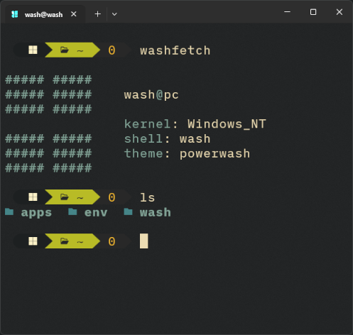

### wash <sub><sup><sub>_(Windows Addicted Shell)_</sub></sup></sub>

A native, (pretty) customizable shell for Windows CMD

 

## Requirements

Windows with Batch interpreter.

Windows CMD or any other terminal emulator with CMD support.

Terminal emulator with ANSII support.

Themes like [`powerwash`](./wash/themes/powerwash.wash-theme) require [NerdFont](https://www.nerdfonts.com/font-downloads).

## Installation

Clone this repository, keep only the [`wash/`](./wash/) directory, and from that point run [`wash.bat`](./wash/wash.bat) instead of `cmd.exe`.

Aliases and programms from showcase are not available by default.

## Usage

To enter wash, run [`wash.bat`](./wash/wash.bat) or execute it in CMD.

To use wash, enter standard CMD commands.

Commands to controll wash are described in the [**Aliases**](./#Aliases) section.

All programms from [`app_dir`](./wash/config.conf) are added to %PATH%.

## Configuration

Many features can be configured directly from the batch script.
Create `.washrc.cmd` at your selected home directory and see the [**Aliases**](./#Aliases) section.

General configuration file is [`config.conf`](./wash/config.conf).
Do not use spaces around the `=` sign.
Do not modify the config structure.

#### Parameters:

`root` - Disk that will be main for wash. Example: `root=C:`

`init_dir` - Directory in root that will be entered on wash startup. Example: `init_dir=\Users`

`home_dir` - Directory in root that will become `~` in `\:w`. Example: `home_dir=\Users\Admin`

`app_dir` - Directory in root that wash will use for locating applications. Example: `app_dir=\Users\Apps`

`theme` - Name of the prompt theme inside `themes/`. Example: `theme=minitf`

## Themes

Themes must be placed in [`themes/`](./wash/themes/).
Only the first line will be read.
Some symbols may cause errors, for example - `!`.
File extension must be `.wash-theme`.

#### Variables:

`\:u` - Windows current user name. Result: `user`

`\:w` - Pretty current directory. Result: `C:\Users`, `~`, `~\Projects`

`\:h` - Current computer name. Result: `USERPC`

`\:?` - Latest exit code. Result: `127`

`\:e` - Escape character. Usage: `\:e[32mGreen Text\:e[0m`

#### Examples:

See [`powerwash`](./wash/themes/powerwash.wash-theme), [`minitf`](./wash/themes/minitf.wash-theme), [`let`](./wash/themes/let.wash-theme), [`gone`](./wash/themes/gone.wash-theme) and [`fr`](./wash/themes/fr.wash-theme).

## Aliases

To create aliases to a commands you can use such thing as `doskey`.
For the best experience, recomended to write them at your `.washrc.cmd`.

#### Built In:

`\washed` - Exit wash.

`\wash` - Reload wash.

#### Examples:

`ls` alias for `eza`:
```batch
@echo off

doskey ls=eza --colour=always $*
doskey la=eza -a -a --colour=always $*
doskey ll=eza -l -a -a --colour=always $*
```

Note that if, for example, `eza` binary is not located somewhere in your %PATH% directories (for example, that one you wrote in [`app_dir`](./wash/config.conf)) it will not be found.

## Wash Protocol

Environment variables are located in [`wash.protocol`](./wash/modules/wash.protocol.bat).

All variables are accessible when an app is run from [`wash`](./wash/wash.bat).

#### Constants:

`%washproto_escape%` - Escape character.

`%washproto_shell%` - Name of the current shell (mostly `wash`).

## Known issues

Do not take wash too seriously.

#### Instability and Maintenance:
Since Batch is a very strict and limited language, wash is difficult to debug and maintain.
Most errors are caused by Batch's specific syntax and interpreter limitations.
For example: Command like `echo "hello && world"` will be interpreted as `echo "hello` and `world"`, or anything that ends with `/?` will print `call` command help page.

#### Experimental Nature and Support:
Initially, wash was created as an experimental, non-trivial fun project.
Despite this, it may still be useful in certain scenarios.
I use it from the day i created it and im not complaining most of the time.

#### Performance and Speed:
Batch is an interpreted scripting language.
Batch was never designed for speed, and there's little that can be done about it.

<sub><sup>Featuring: Tea</sup></sub>
